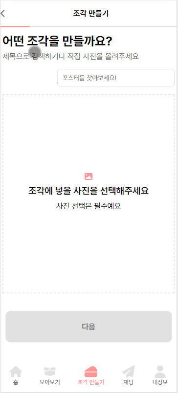
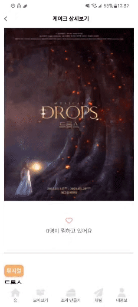
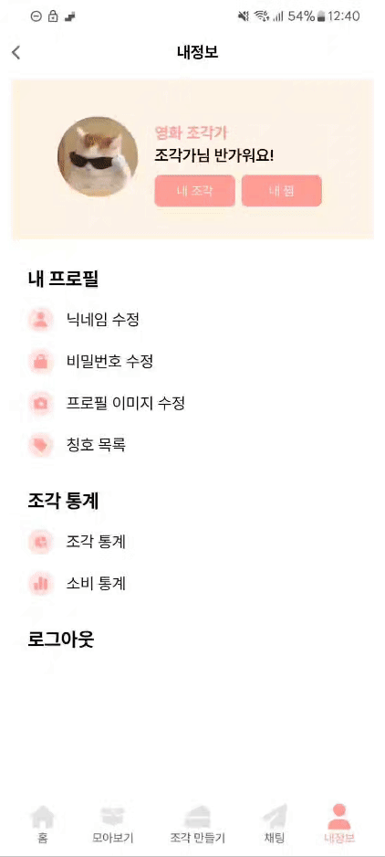
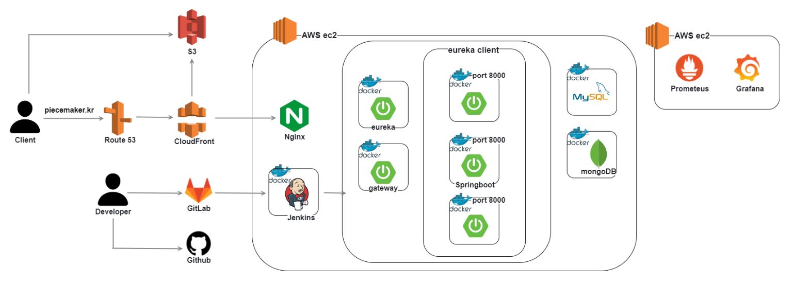
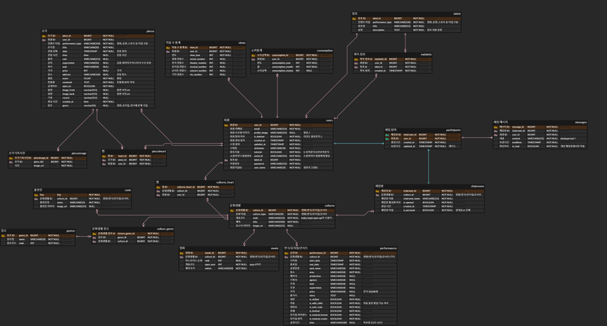

# 🍰 PIECE - 문화생활의 한 조각을 채우는

# 🌟 서비스 소개

영화 티켓을 모은 적이 있으신가요?
영화, 연극, 뮤지컬, 콘서트의 감상평을 남긴 적이 있으신가요?

저희는 사진과 생성형 AI를 통해 나만의 티켓 이미지를 만들어
간단하게 문화생활의 마지막 조걱을 채우고자 시작했습니다.

PIECE에서 문화생활의 한 조각을 채워보세요!

 
 

# 💡 주요 기능

  

 
### 조각 만들기
- 사진을 업로드하거나 제목으로 포스터를 검색할 수 있어요.
- 조각에 공연명, 날짜, 시간, 출연진 등 정보를 입력할 수 있어요.
- 별점과 감상평을 남길 수 있어요.
- 조각 레이아웃을 선택할 수 있어요.
- 생성형 AI를 통해 나만의 조각을 완성할 수 있어요.

### 조각 모아보기
- 내 조각을 캘린더 형식으로 볼 수 있어요.
- 조각을 찜하거나 링크를 공유할 수 있어요.
- 자세히 기록하기를 통해 사진과 글을 추가로 작성할 수 있어요.

### 케이크 모아보기
- 다양한 케이크의 정보를 한 눈에 볼 수 있어요.
- 하나의 케이크에서 다른 사람들과 채팅을 나눌 수 있어요.

### 채팅하기
- 하나의 케이크에서 비롯된 오픈 채팅을 나눌 수 있어요.
- 1:1 채팅을 나눌 수 있어요.

### 나만의 공간
- 조각을 완성하면 다양한 칭호가 주어져요.
- 내가 만든 조각으로 조각 통계를 보여드려요.
- 조각에 작성한 정보를 바탕으로 소비 통계를 보여드려요.

 
 

# 🛠️ 주요 기술 스택

-   Infra : AWS, Jenkins, Docker, Nginx, Grafana, Prometheus
-   BackEnd : Java, Spring, JPA
-   FrontEnd : Vue
-   DataBase : MySQL, MongoDB
-   Etc : AmazonS3, GitLab

 
 

# ⚙ 시스템 아키텍처

 
 

# 🎂 팀원 소개 및 프로젝트 기간
<table>
    <tr>
        <td height="140px" align="center"> 
                👑 이혜진  (Full-Stack) </a>  </td>
        <td height="140px" align="center"> 
                🍰 권근형  (Full-Stack) </a>  </td>
        <td height="140px" align="center"> 
                🍰 김현진  (Infra) </a>  </td>
        <td height="140px" align="center"> 
                🍰 노현석  (Full-Stack) </a>  </td>
        <td height="140px" align="center"> 
                🍰 이아진  (Full-Stack) </a>  </td>
        <td height="140px" align="center"> 
                🍰 김보라  (Full-Stack) </a>  </td>         
    </tr>
    <tr>
        <td align="center">
        [BE] 조각만들기 
         
        [FE] 조각 모아보기
         </td>
        <td align="center">
        [BE] 로그인, 보안
         
        [FE] 로그인
         </td>
        <td align="center">
        [INFRA] 서버 구축
         
        [BE] 이미지 저장  
         
        [FE] 조각 통계
         </td>
        <td align="center">
        [INFRA] MSA
         
        [BE] 케이크 모아보기  
         
        [FE] 조각 만들기
         </td>
        <td align="center">
        [BE] 채팅 
         
        [FE] 채팅
         </td>    
       <td align="center">
        [BE] 조각 통계, 조각 검색 
         
        [FE] 조각 만들기
         </td>   
    </tr>
</table>

### 🍰 조각가들 : 24.4.09 ~ 24.05.19

 
 

# 📝 설계 문서

### ERD

### [API 명세서](https://lab.ssafy.com/s10-final/S10P31B202/-/blob/master/exec/asset/API_%EB%AA%85%EC%84%B8%EC%84%9C.pdf)
